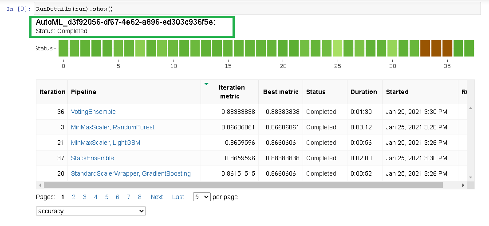
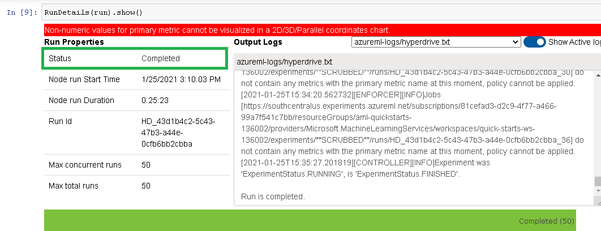

Need to Include

-- An overview of the method used to get the data into your Azure ML Studio workspace.
-- An overview of your AutoML experiment settings and configuration
-- An overview of the types of parameters and their ranges used for the hyperparameter search
-- An overview of the two models with the best parameters
-- An overview of the deployed model and instructions on how to query the endpoint with a sample input
-- A short overview of how to improve the project in the future

# Your Project Title Here

## Project Overview 

For Udacity's Machine Learning Engineer with Microsoft Azure Nanodegree capstone project we had to choose a dataset, task, and metric for a machine learning problem, do training with both Azure Hyperdrive and AutoML, register the best models from each, deploy the best performing of the two models, and consume the endpoint.

## Dataset

### Overview

The dataset I chose is the Heart Failure clinical records Data Set that can be found [here](https://archive.ics.uci.edu/ml/datasets/Heart+failure+clinical+records) at the UCI Machine Learning repository.  For the project, I was browsing the UCI machine learning repository for datasets to use as these sets are smaller than ones found on other sites such as data.gov.  After looking through the daasets, this one was of particular interest due to having a family history of heart disease.

The dataset is comprised of 299 records of heart failure patients with 13 attributes and no missing values.  All attributes are numeric consisting of both continuous and discrete values.  

### Task

The dataset was used for supervised learning binary classification with DEATH_EVENT column being the target.  Death event is a boolean value with 0 being there was no death before the follow up and 1, there was a death event. Upon predicting of a possible death event, doctors may want to call patients in for a further checkup or switch medications or dosages.  All parameters were used during training.

### Access

In both notebooks the dataset was read in using Dataset.Tabular.from_delimited_files using the url of that dataset at the UCI machine learning repository site and then registered in Azure if it hadn't been already.

For AutoML the dataset is then converted to a pandas dataframe and split into a train and test set.  The training set is then written to a file and then read into a tabular dataset to send to the experiment using Dataset.Tabular.from_delimited_files.
The training set is used for automl training.
After training the test set is split into x_test and y_test for testing.
Finally during deployment, the first two rows of the test set, excluding DEATH_EVENT, are sent to the endpoint for prediction.

For hyperdrive, the train.py file reads the data in using the url, as was originally done before registering, converts it to a pandas dataframe, pops Death Event off and splits it into x and y training and test sets using the same random seed as was used in the automl notebook. 
The x_train and y_train are used to fit the logistic regression model and the x_test and y_test are used to compute accuracy.

## Automated ML

To reduce the time taken to train, experiment_timeout_minutes of 30 and 50 iterations were chosen. In order to utilize more than one node at once, since 4 where allocated, max_concurrent_iterations were set to 4. Early stopping is enabled so if a run is not performing well, it can stop early, again to save time and if not performing well continuing seems uncessary. The local compute was chosen as this may be slower but generally provides better results. Also 5 cross validations were chosen to split the data into 80%/20% train and test sets and help balance variance and bias.

### Results
*TODO*: What are the results you got with your automated ML model? What were the parameters of the model? How could you have improved it?

*TODO* Remeber to provide screenshots of the `RunDetails` widget as well as a screenshot of the best model trained with it's parameters.

The top performing model was a VotingEnsemble with 88% accuracy.  

#### Screenshots: Run Details

#### Screenshots: Model

## Hyperparameter Tuning
*TODO*: What kind of model did you choose for this experiment and why? Give an overview of the types of parameters and their ranges used for the hyperparameter search

### Model

As the task is binary classification, I chose to use Scikit-Learn's logistic regression for hyperparameter tuning.  I have used logistic regression before in machine learning courses and am more familiar with it than other supervised learning classification algorithms.

### Hyperparameters chosen to tune
The parameters I chose to tune are
C: the inverse of the regularization strength
solver: what algorithm is used for optimization
max_iter: max number of iterations to take for the solver to converge

// why only these three?
// may want to look back to your project 1 for this
// go over what types of values it takes (discrete choices like solver or more continuous), what the defaults are, and what options you allowed

### Settings

### Results
*TODO*: What are the results you got with your model? What were the parameters of the model? How could you have improved it?

*TODO* Remeber to provide screenshots of the `RunDetails` widget as well as a screenshot of the best model trained with it's parameters.

#### Screenshots: Run Details

#### Screenshots: Model

## Model Deployment
*TODO*: Give an overview of the deployed model and instructions on how to query the endpoint with a sample input.

// Be sure to state which model is deployed

// Be sure to include a screenshot of the endpoint

### Screenshots: Endpoint In Active State

### Screenshots: Swagger Schema for Endpoint

// may want to include the url screenshot

### Call to endpoint

## Screen Recording
https://youtu.be/wbC8YtjXAx4

## Suggestions

// put in order of what you want to do right away

* Require authentication to access the endpoint
To avoid attacks against the endpoint, authorization should be required.
 
* Use recall instead of accuracy for the primary metric
With DEATH_EVENT being the y value, recall should be used as the primary metric instead of accuracy as a false negative is literally deadly.  I plan to change this in the near future but because the end of the nanodegree is near, I am keeping accuracy as the primary metric when submitting my capstone.

* Hyperdrive: Exploratory data analysis and feature selection
Other than using every attribute, an exploratory data analysis with feature selection prior to training would improve the HyperDrive performance.  Having taken a course in linear regression, I know how to determine what features to include or exclude for linear regression models.  However I am presently uncertain how to do feature selection for classificcation problems.  

* Hyperdrive: Save the training set to storage so train.py doesn't split it every call

* Hyperdrive: Test the model before registering it
Being uncertain of how to retrieve the model from a hyperdrive run before registering it, no testing of the model was done.  It is always a good idea to test the model before registering, as was done with Auto ML.  I need to research how to retrieve the model so it can be tested. 

* AutomatedML: Enable the use of deep neural networks
For greater variety, usage of deep neural networks should be enabled.

* Enable Application Insights
In order to examine the usage and performance of the endpoint, application insighs should be enabled.
